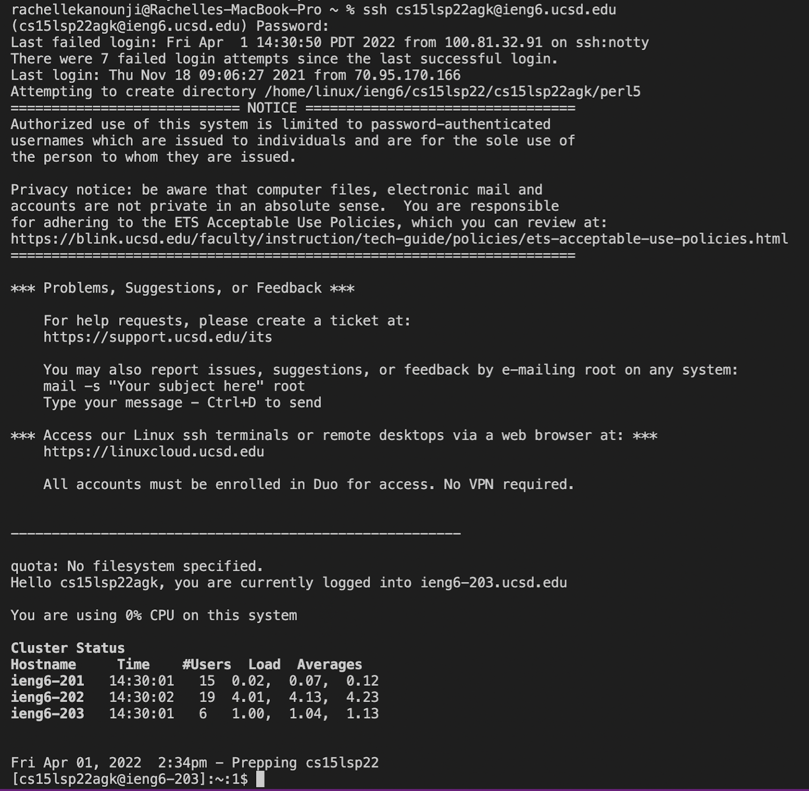
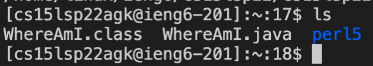
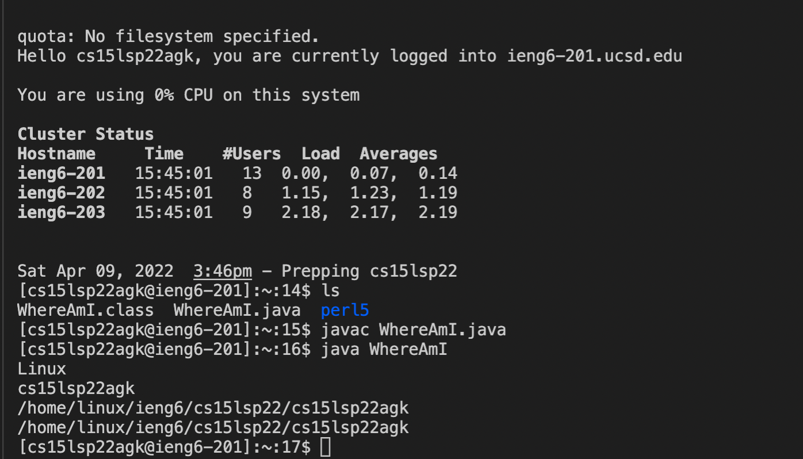
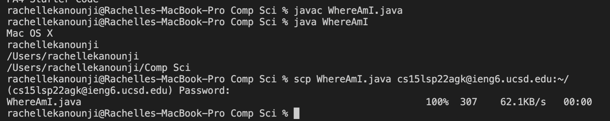
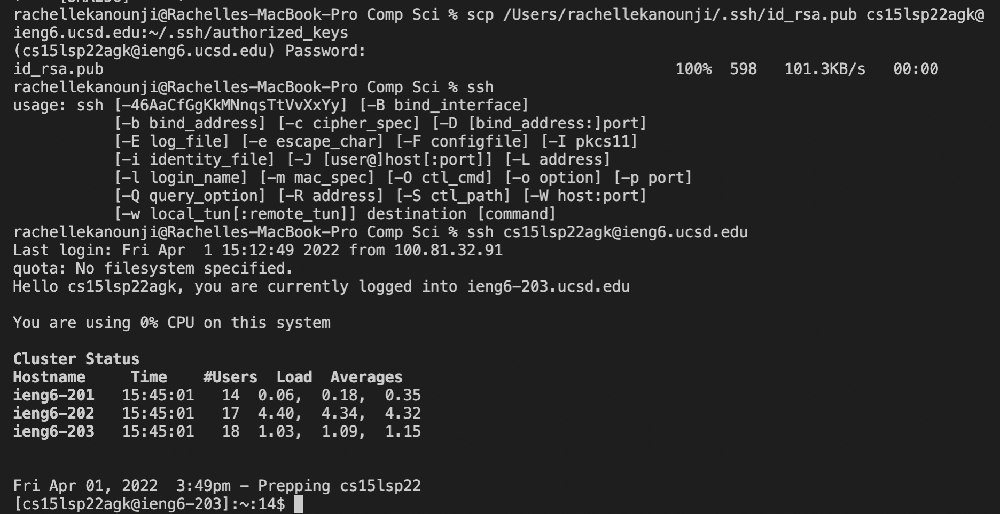
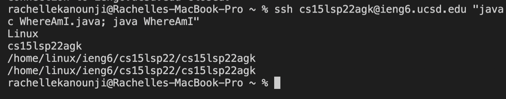

# Week 2 Lab Report by Rachelle Kanounji

### Installing VScode
Before you start anything, you must download Visual Studios on your computer, which you can go on [Visual Studio code website](https://code.visualstudio.com/) and download the version you need. The image below is what Visual Studios Code looks like successfully downloaded. 
 

### Remotely Connecting
1. Write in the terminal $ ssh (course specific account)@ieng6.ucsd.edu
2. Type in yes, if you recieved messages and give password when asked 
 

### Trying Some Commands
      
Now try some commands in your terminal. I tried ls which lists all the files in the current directory. The image shows running the command ls in my terminal 

 

### Moving Files with scp
In Visual Studio Code create a new file with content in it and then compile and run. Once it run write in the terminal  scp (the file name) (course specific account)@ieng6.ucsd.edu:~/ and then enter your password when asked. Once it's in your home directory, then do the same steps to run it in the server.  
 
The following image is what your terminal should look like successfully using ssh 

The following image is what your terminal should look like successfully using scp 

### Setting an SSH Key
 1. To not have to continously enter your password, on the client (your computer) run $ ssh-keygen and continue to press enter 
2. Once you see key's randomart image in the terminal, run $ ssh (course specific account)@ieng6.ucsd.edu and enter password (in client) then on server run $ mkdir .ssh and finally run $ scp /Users/<user-name>/.ssh/id_rsa.pub (course specific account)@ieng6.ucsd.edu:~/.ssh/authorized_keys (in client). 
Here's what it looks like with SSH keys 
 
### Optimizing Remote Running
1. At the end of of an ssh command, write in quotes a command, in order to run in on the remote server and then exit (which you can write/command exit in the terminal). 
2. Then write in the terminal compling and running your file. 
 
 
 
 

