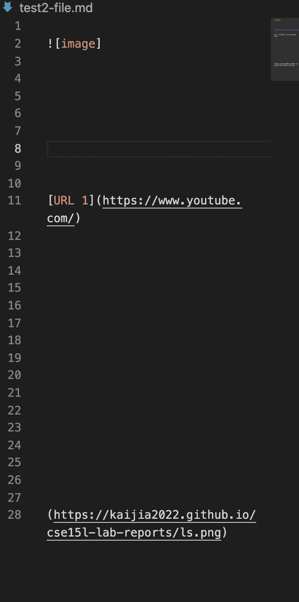
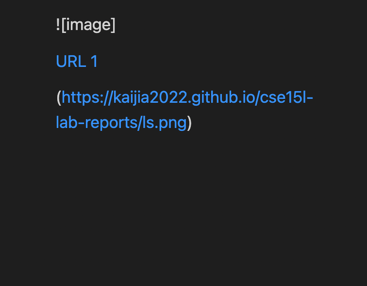

# Week 4 Lab Report by Rachelle Kanounji

Here is the code my partner and I did to fix at least 3 bugs in the test files


### In Test File 2 
Here is what test file 2 looks like 

And here is what it outputs 


The bug in this test file is that in the last part there is no brackets ```[]``` before the link of the image. So the symptom just shows ```Exception in thread "main" java.lang.StringIndexOutOfBoundsException: begin 0, end -1, length 2.``` To fix this mistake we made an if statement there are no brackets in front of the parenthesis to ignore this bug and keep the parenthesis with the link of the image. 
Here is the exact part in our code that fixed this: 


### In Test 3 File 
Here is what test 3 file looks like 

And here is what it outputs 


The bug in this test file is that there's a slash ```\``` character inside the brackets of "Are you ". The symptom of this will not show the link in the parenthesis due to this character. To fix this mistake we made an if statement to ignore this slash character and find the end bracket. 

Here is the exact part in our code that fixed this: 

