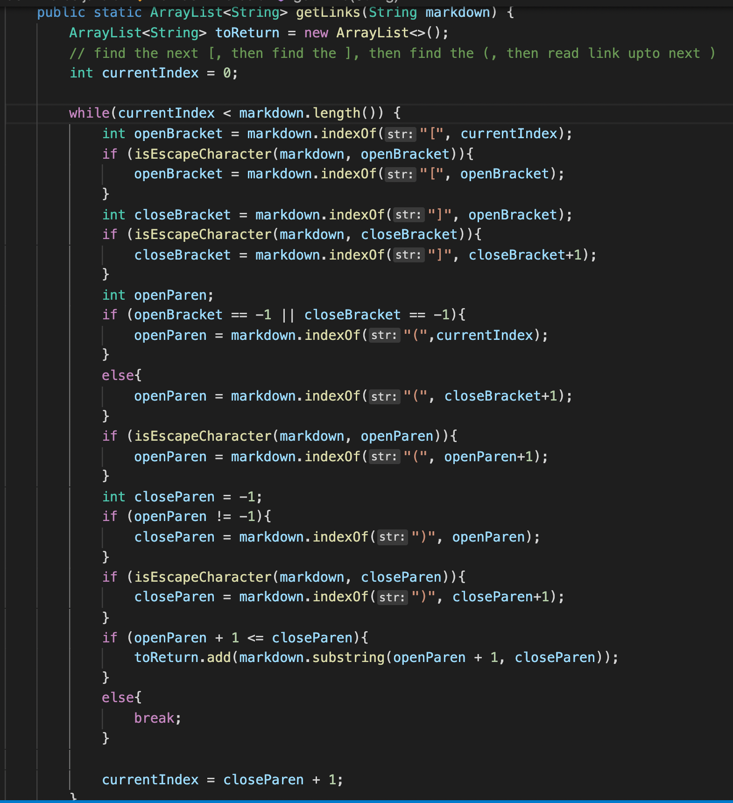
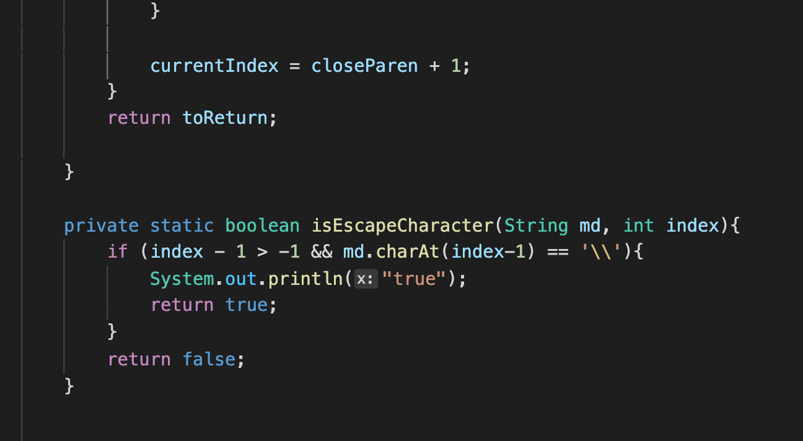
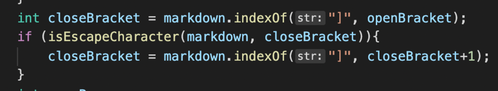

# Week 4 Lab Report by Rachelle Kanounji

Here is the code my partner and I did to fix at least 3 bugs in the test files



### In Test File 2 
Here is test file 2 that gave a failure-inducing input that prompted us to make that change [test 2](https://github.com/kaijia2022/markdown-parser/blob/main/test2-file.md)


The bug in this test file is that in the last part there is no brackets ```[]``` before the link of the image. So the symptom just shows ```Exception in thread "main" java.lang.StringIndexOutOfBoundsException: begin 0, end -1, length 2.``` To fix this mistake we made an if statement there are no brackets in front of the parenthesis to ignore this bug and keep the parenthesis with the link of the image. 
Here is the exact part in our code that fixed this: 


### In Test 3 File 
Here is test file 3 that gave a failure-inducing input that prompted us to make that change [test 3](https://github.com/kaijia2022/markdown-parser/blob/main/test3-file.md)


The bug in this test file is that there's a slash ```\``` character inside the brackets of "Are you ". The symptom of this will not show the link in the parenthesis due to this character. To fix this bug we made an if statement to ignore this slash character and find the end bracket. 

Here is the exact part in our code that fixed this: 




### In Test 1 File 
Here is test file 1 that gave a failure-inducing input that prompted us to make that change [test 3](https://github.com/kaijia2022/markdown-parser/blob/main/test-file1.md)

The bug in this test file was the extra line underneath the links. The symptom of this gave an infinite loop. To fix this bug we made an if and else statement to break once there was brackets and parenthesis with the proper name and links so there will not be an infinite loop with extra lines/spaces in the code. 

Here is the exact part in our code that fixed this: 


