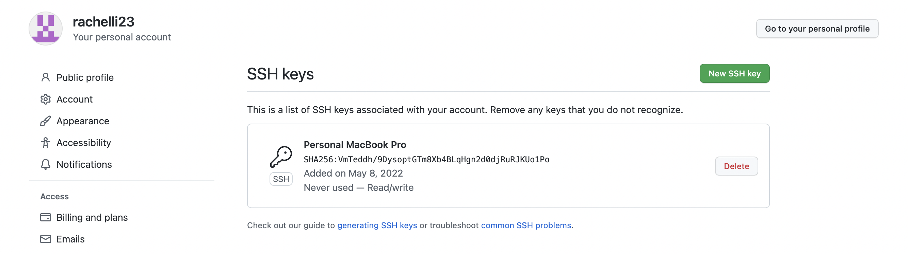
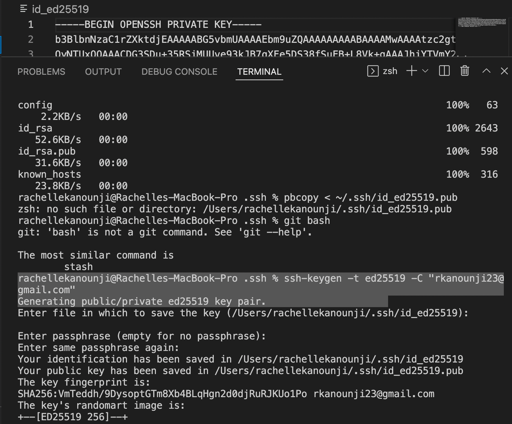

# Lab 3 Report By Rachelle Kanounji 

### Streamlining ssh Configuration
 

 

To not continously rewrite my username and to save a lot of time I made a .ssh/config file. Making edits in VSCode, I save time by making an alias so the computer remembers my username and I don't have to rewrite it multple times. I also copied a file using the alias. 

### Setup Github Access from ieng6

