# Lab 3 Report By Rachelle Kanounji 

### Streamlining ssh Configuration
 
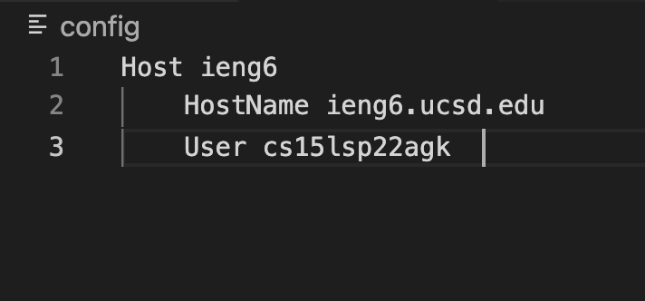

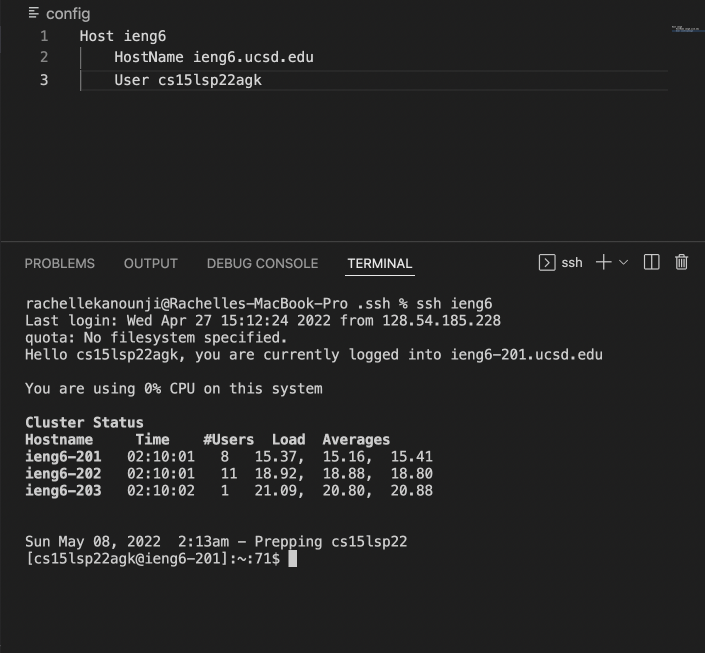
 
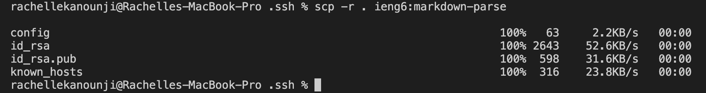

To not continously rewrite my username and to save a lot of time I made a .ssh/config file. Making edits in VSCode, I save time by making an alias so the computer remembers my username and I don't have to rewrite it multple times. I also copied a file using the alias, bu writing ```ssh ieng6 ``` in the terminal.  


### Setup Github Access from ieng6
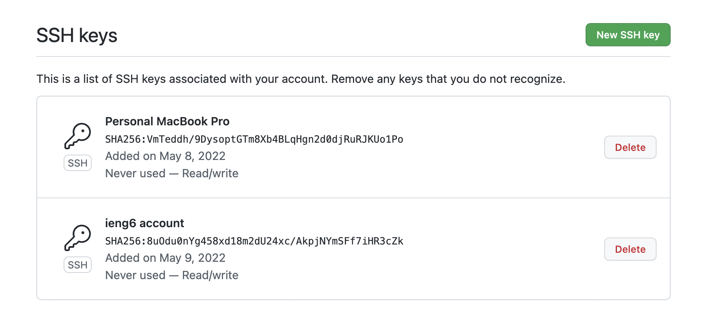

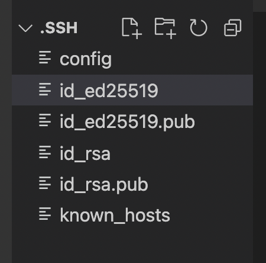

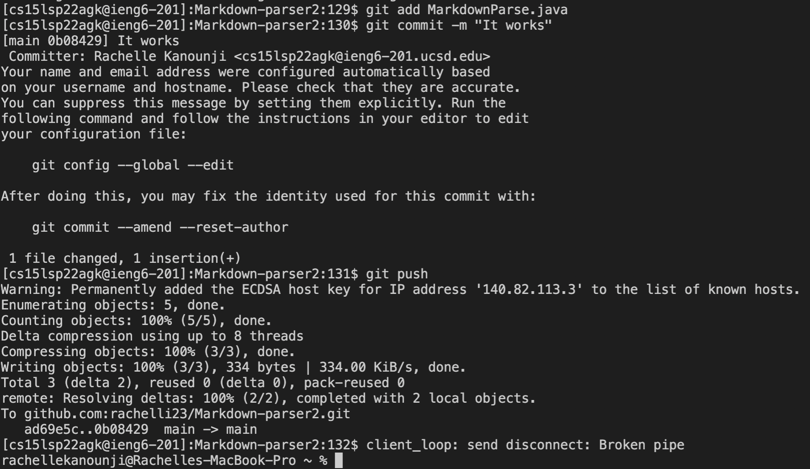

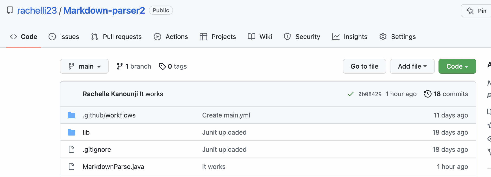

 [Link for the resulting commit](https://github.com/rachelli23/Markdown-parser2/commit/0b084294d16fd025d386b17c84038cb29c6d1b88)
 
 Making a public and private key to access the Github Markdown Parser on a different device. Ran git commands to commit and push changes from my ieng6 account to the directory of Markdown Parser. The git commands I wrote in the terminal are ``` git add MarkdownParse.java``` , ```git commit -m "It Works" ```, and ``` git push ```
 
### Copy whole directories with scp -r
 
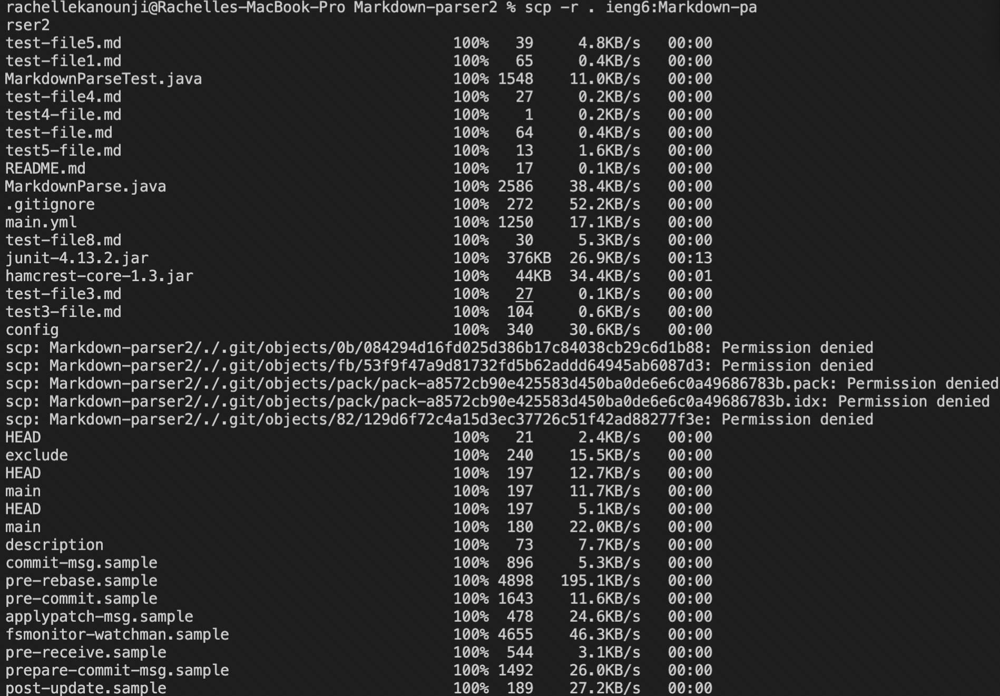

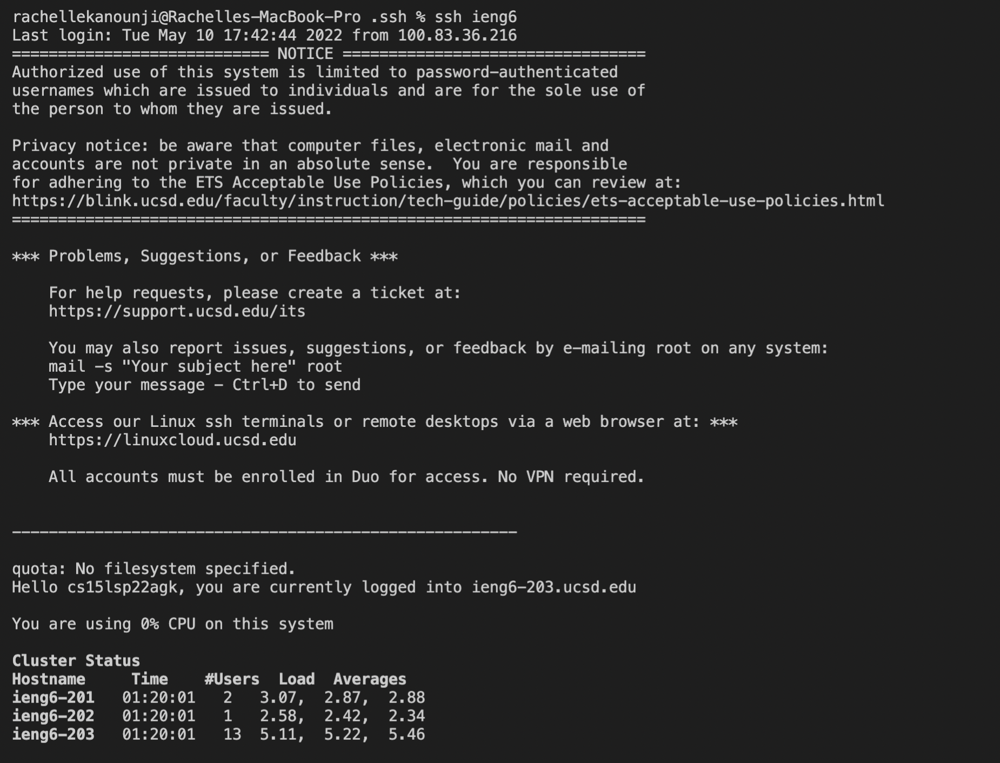

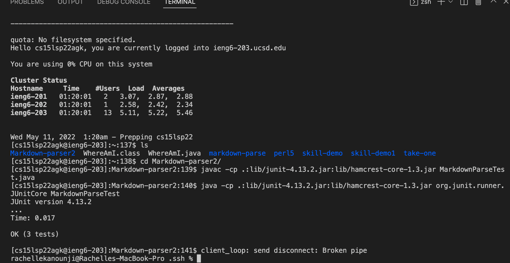

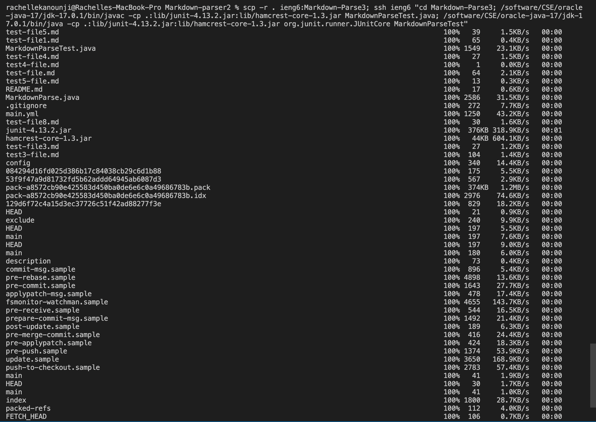


Coping from my local machine which is the markdown-parse2 directory to my remote machine which is my ieng6 account. In the terminal I wrote, ``` scp -r .ieng6:Markdown-pa```.  I made a new folder called Markdown-Parse3 in my ieng6 account to have the copy of markdownparser. Then complied and ran in my ieng6 account. Ran combing scp, ;, and ssh to copy the whole directory


