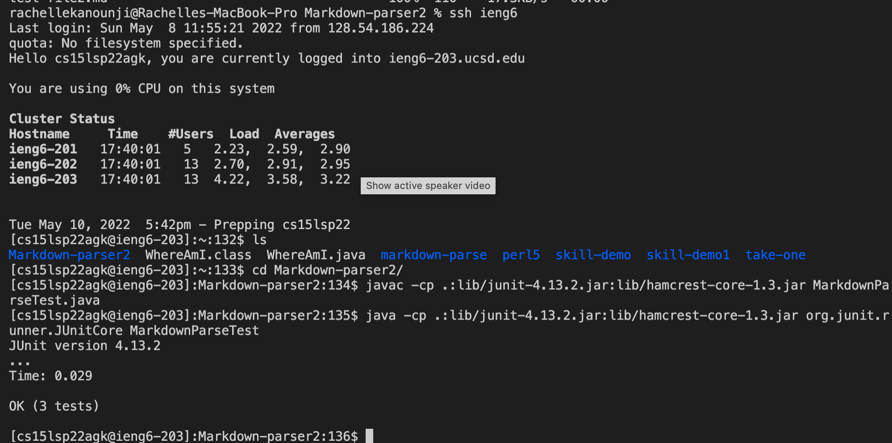

# Lab 3 Report By Rachelle Kanounji 

### Streamlining ssh Configuration
 

 

To not continously rewrite my username and to save a lot of time I made a .ssh/config file. Making edits in VSCode, I save time by making an alias so the computer remembers my username and I don't have to rewrite it multple times. I also copied a file using the alias. 

### Setup Github Access from ieng6

 [Link for the resulting commit](https://github.com/rachelli23/Markdown-parser2/blob/main/MarkdownParse.java)
 
 Making a public and private key to access the Github Markdown Parser on a different device. Ran git commands to commit and push changes from my ieng6 account to the directory of Markdown Parser.  
 
 ### Copy whole directories with scp -r

 
