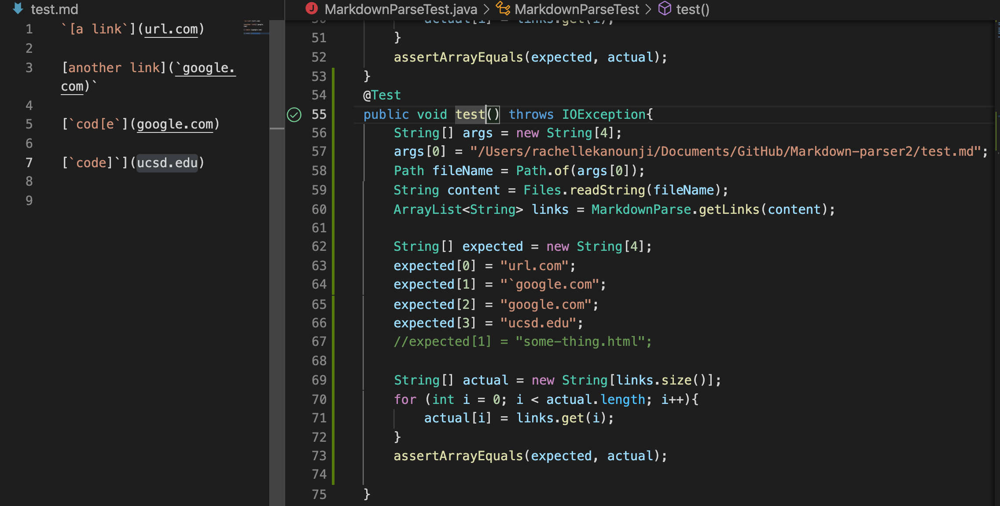
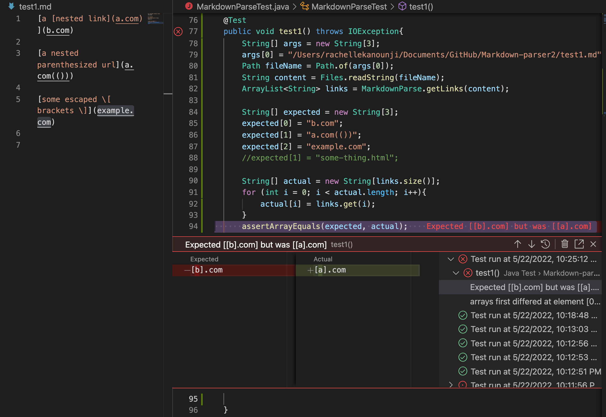
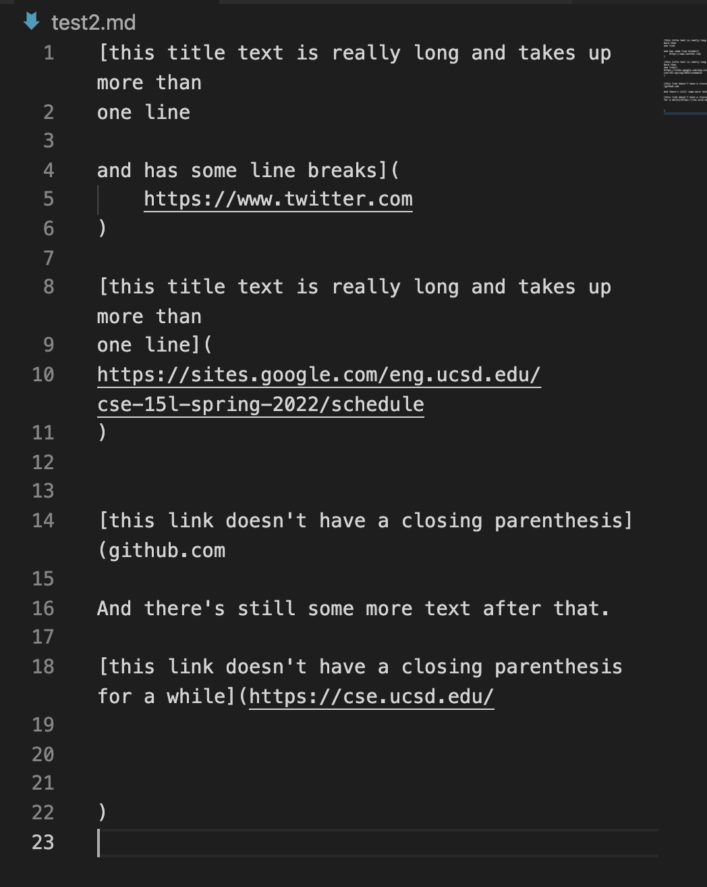
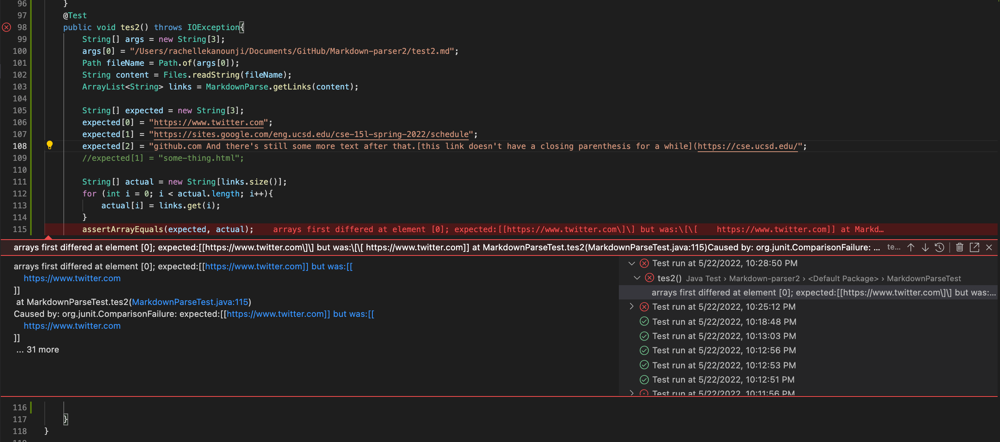

### Lab Report 4 By Rachelle Kanounji 

Here is the snipet 1 in my test file, the tester in my MarkdownParserTest file, and the output 

This passed!

Here is the snipet 2 in my test1 file, the tester in my MarkdownParserTest file, and the output 

This failed!
Here is the snipet 3 in my test2 file, the tester in my MarkdownParserTest file, and the output 

This failed! 

# Question 1 
My code works for snipet 1. The reason my code works for snipet 1 because I have an if statements to ignore extra characters in the brackets and parenthesis and just run the code inside the bracket and parenthesis to produce a link. 

# Question 2 
I do think there is a (<10 lines) code change that will make my program work for snipet 2. The code change would be an if statements to ignore extra brackets and parenthesis and possibly have the if statement match with one open bracket to the end bracket and same with the parenthesis. 

# Question 3 
I do think there is a (<10 lines) code change that will make my program work for snipet 3. The code change would be an if statements to ignore the extra spaces between the parenthesis and brackets. The if statement would just have to check where the next bracket or parethesis, like where it's at. 
