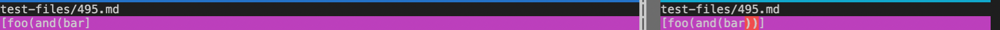
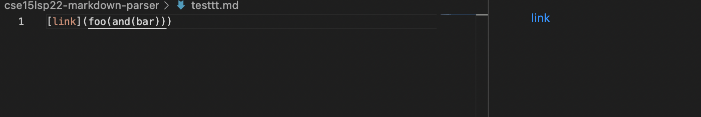
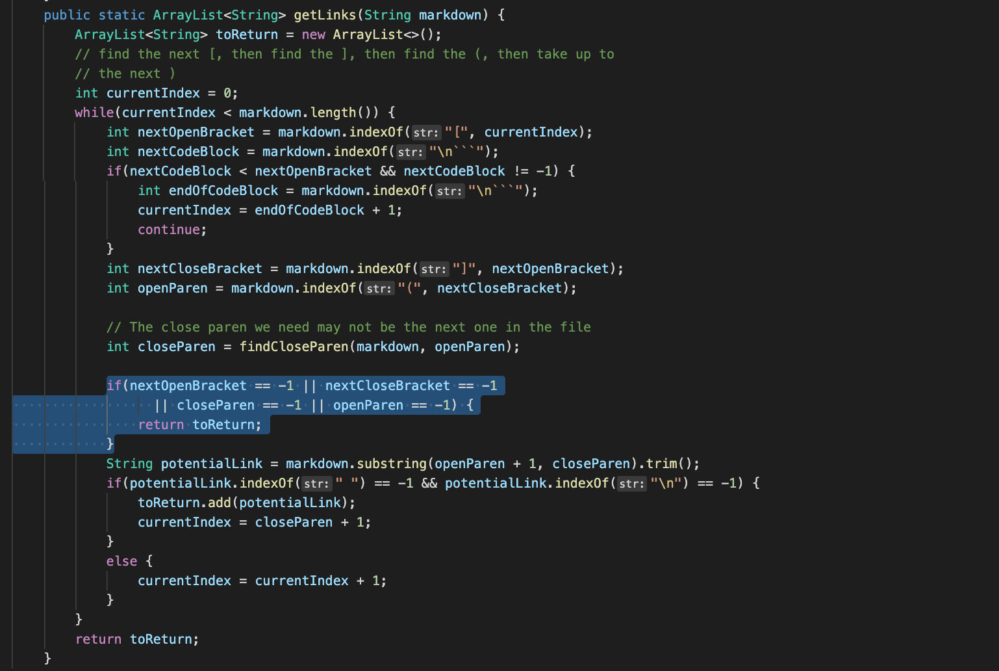
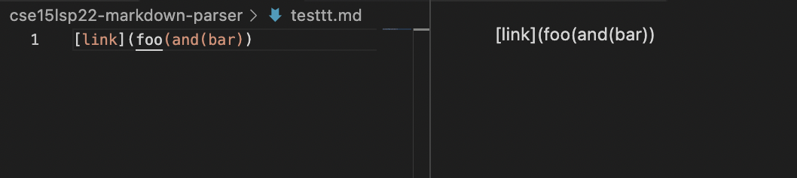
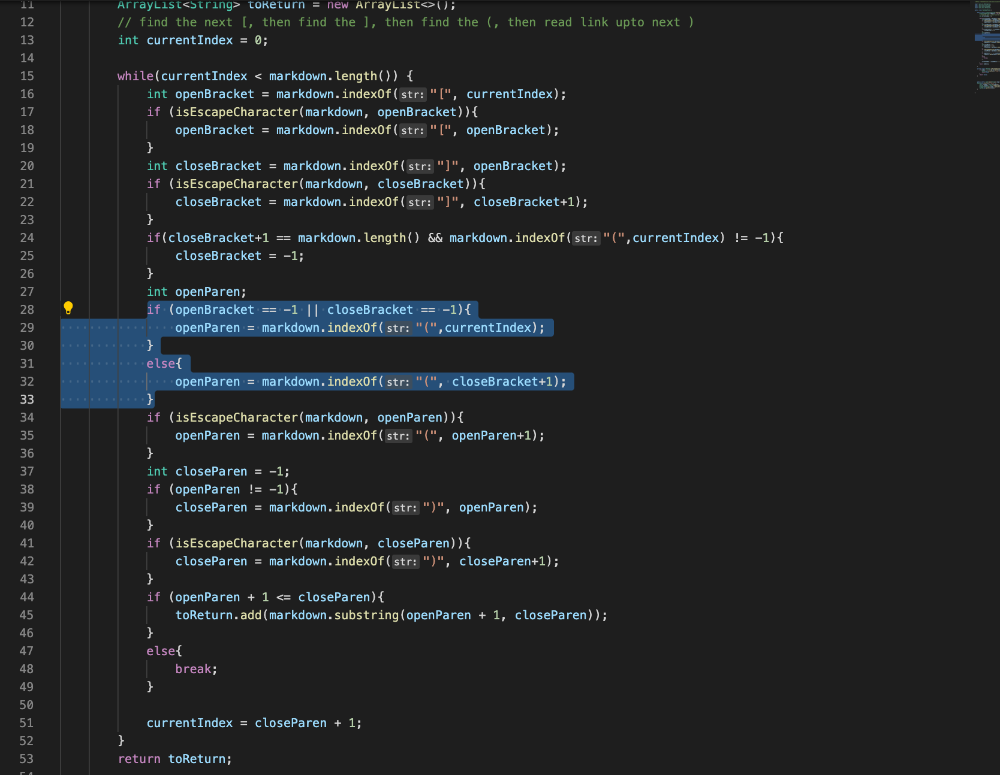

# Lab Report 5 By Rachelle Kanounji 

I found the test with different results through vimdiff. 

[Link of test 495](https://github.com/nidhidhamnani/markdown-parser/blob/c7680904bc390e500c7c98e4789d1410249c2982/test-files/495.md?plain=1)

Here is an image of the vimdiff file comparision of 496.md; which is ran through the my ```MarkdownParse.java``` and the provided ```MarkdownParse.java``` 



The preview does not show a valid link, so I believe the CSE15 link provided [The link](https://github.com/nidhidhamnani/markdown-parser.git) gives the correct output of ```495.md``` (which is on the right). The provided ```MarkdownParse.java``` gives the correct output of closing the parenthsis since it needs to close brackets and parenthesis in order for it to be a valid link. My implentation (which is on the left) gives the incorrect output since it does not close the two parenthesis. To fix this in my code, I need to check/add if there are closing parentheis and brackets. If there are not to possible add the parenthesis and brackets so it can produce a valid link. 

Here is what the file should produce by using VScode preview 


Here is the code that should be fixed


### Other Test File 
[Link of test 496](https://github.com/nidhidhamnani/markdown-parser/blob/c7680904bc390e500c7c98e4789d1410249c2982/test-files/496.md)

Here is an image of the vimdiff file comparision of 496.md; which is ran through the my ```MarkdownParse.java``` and the provided ```MarkdownParse.java``` 


The preview does not show a valid link, so I believe the CSE15 link provided [The link](https://github.com/nidhidhamnani/markdown-parser.git) gives the correct output of ```496.md``` (which is on the right). The provided ```MarkdownParse.java``` gives the correct output of an empty brackets since there is no valid link. My implentation (which is on the left) gives the incorrect output since it does not check if the inside test is an actual valid link. To fix this in my code, I need to check for special character like a period (.), or slashes (/), or anything that makes a link special. If it were to check these special charaters then it can add the text to the brackets and be produced by the parser.  

Here is what the file should produce by using VScode preview 


Here is the code that should be fixed

